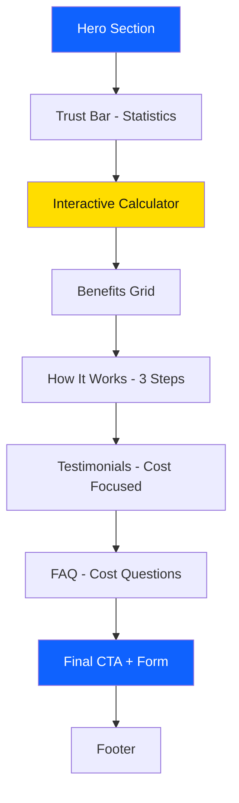

# Nethoreca Cost Calculator Landing Page

## Overview

Creating a **production-ready, high-converting Cost Calculator Landing Page** for Nethoreca's textile rental service targeting Polish hotel managers. This concept was selected for highest conversion potential because:

- **Primary driver**: Hotel managers prioritize cost/ROI (primary decision factor in Polish market)
- **Interactive engagement**: Calculators increase time on page by 2-3x
- **Lead qualification**: Captures hotel size for sales follow-up
- **Immediate value**: Shows savings before asking for commitment

> [!IMPORTANT]
> **Selected Concept: Cost Calculator (Kalkulator Oszczędności)**
> 
> This page will allow hotel managers to input their hotel details and see potential savings from switching to Nethoreca's textile rental service.

---

## Proposed Changes

### NEW Landing Page Route

#### [NEW] [page.tsx](file:///C:/Users/MY/.gemini/antigravity/scratch/nethoreca-website/src/app/kalkulator-oszczednosci/page.tsx)

New dedicated landing page with:
- Hero section with value proposition and calculator preview
- Interactive savings calculator (room count, current spending)
- Trust signals and social proof
- Benefits section with cost comparison
- Testimonials focused on cost savings
- Process visualization (how it works)
- Lead capture form with GDPR compliance
- FAQ section addressing cost concerns
- Final CTA section

#### [NEW] [page.module.css](file:///C:/Users/MY/.gemini/antigravity/scratch/nethoreca-website/src/app/kalkulator-oszczednosci/page.module.css)

Complete CSS styling with:
- Mobile-first responsive design (320px, 768px, 1024px breakpoints)
- Interactive calculator styling with form inputs
- Result display with animations
- Trust badge layouts
- Exit-intent popup styling
- Sticky mobile CTA button

---

## Page Structure

---

## Key Design Decisions

### Calculator Logic
- Input: Number of rooms, current monthly textile cost
- Output: Estimated monthly savings (15-25% reduction)
- Formula: Based on industry averages for similar hotel sizes
- CTA: "Zobacz Pełną Analizę" → Leads to form

### Polish B2B Copy Strategy
- Formal "Pan/Pani" addressing throughout
- Focus on "oszczędności" (savings), "ROI", "optymalizacja kosztów"
- Trust signals: 26+ lat, 500+ hoteli, ISO certifications
- No aggressive sales tactics - professional consultant tone

### Conversion Elements
- Sticky CTA on mobile scroll (below fold)
- Exit-intent popup with special offer ("15% rabatu")
- Form with maximum 5 fields
- Click-to-call button prominent on mobile
- Social proof immediately after calculator results

### GDPR Compliance
- Privacy policy checkbox
- Cookie consent reference
- Data processing notice in Polish
- Link to full privacy policy

---

## Technical Specifications

| Metric | Target |
|--------|--------|
| Page Load | < 3 seconds |
| First Contentful Paint | < 1.5s |
| Lighthouse Performance | 90+ |
| Mobile-first | Yes |
| WCAG 2.1 AA | Compliant |

### Responsive Breakpoints
- Mobile: 320px - 767px
- Tablet: 768px - 1023px
- Desktop: 1024px+

---

## Verification Plan

### Automated Tests
- Lighthouse performance audit
- Responsive design testing across breakpoints
- Form validation testing
- Calculator logic verification

### Manual Verification
- Visual review in browser at all breakpoints
- Calculator functionality testing
- Form submission flow (simulated)
- Polish language review for business appropriateness

---

## Files to Create

1. `src/app/kalkulator-oszczednosci/page.tsx` - Landing page component
2. `src/app/kalkulator-oszczednosci/page.module.css` - Page styles

## Estimated Conversion Rate

Based on best practices and the interactive calculator approach:
- **Target: 6-8% conversion rate** (vs. 1-2% industry average)
- Supporting factors:
  - Interactive element increases engagement
  - Immediate value demonstration
  - Strong trust signals
  - Clear, single call-to-action
  - Mobile-optimized design
